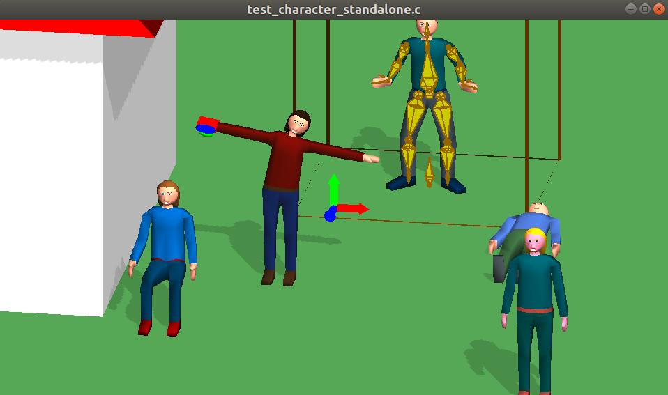

# Header-Only-GL-Helpers
A collection of header files that can ease OpenGL programming.

Filename             | Language | Needs OpenGL | Description
---------------------|----------|--------------|-----------------------------------------------------------------
teapot.h             |   C/C++  |      Yes     | The basic file that is used in all the demos. It can display the teapot mesh and a lot of other meshes
dynamic_resolution.h |   C/C++  |      Yes     | Implements dynamic resolution and the first shadow mapping pass 
im_matrix_stack.h    |   C/C++  |      No      | Implements a matrix stack and some other helper methods
sdf.h                |   C++    |      Yes     | Signed distance fonts to display text on screen
minimath.h           |   C/C++  |      No      | Just a collection of all the math of the other files (no example available)  
character.h  (WIP)   |   C/C++  |  Recommended | Animated character implementation     

# Demos
The following demos are available: test_teapot.c, test_shadows.c, test_matrix_stack.c, test_character_standalone.c, test_character.c and test_sdf.cpp.
Command-lines to compile them on Linux, Windows and Emscripten are present at the top of the files.

### Dependencies (demos only)
* glut (or freeglut)
* glew (Windows only)

# Screenshots
### Click on images for WebGL demos

